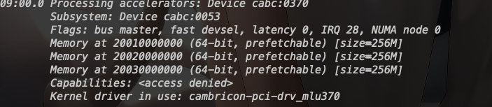
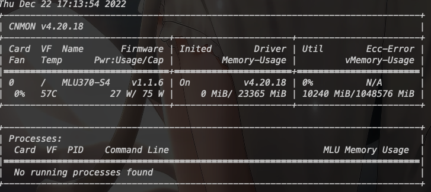
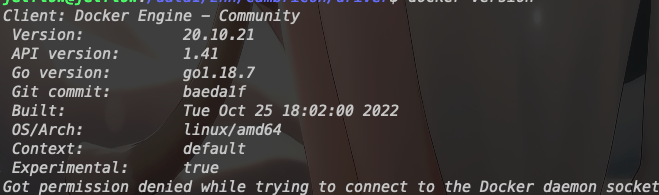

# dev_env_cambricon


## Dependence

* ubuntu18.04
* [MLU370-S4智能加速卡](https://www.cambricon.com/index.php?m=content&c=index&a=lists&catid=365)


## Installation


* [driver tookit eg...](https://pan.baidu.com/s/1Yw6bP1lP58CZV5Pox_vVZw?pwd=2pqy)     密码：2pqy

```
#检查设备资源是否分配成功
lspci -v -d:0370
```

<div align="center">
    <a href="./">
        
    </a>
</div>

这里选择的驱动版本是 cambricon-mlu-driver-ubuntu18.04-dkms_4.20.18_amd64.deb

[寒武纪ubunt安装方式有两种，这里使用dpkg，另一种使用apt安装](https://www.cambricon.com/docs/sdk_1.9.0/driver_4.20.18/user_guide_4.20.18/driver_3/driver_3.html#ubuntudebian)

``` shell
sudo dpkg -i cambricon-mlu-driver-ubuntu18.04-dkms_4.20.18_amd64.deb
```
``` shell
cnmon
```
<div align="center">
    <a href="./">
        
    </a>
</div>

* cnmon成功则说明驱动安装成功

* docker安装(version>=v19.03)

``` shell
docker --version
```
<div align="center">
    <a href="./">
        
    </a>
</div>


* 在百度网盘中下载magicmind_1.0.1-1_ubuntu18.04.tar.gz驱动

``` shell
sudo docker load -i magicmind_1.0.1-1_ubuntu18.04.tar.gz

sudo docker images
```

